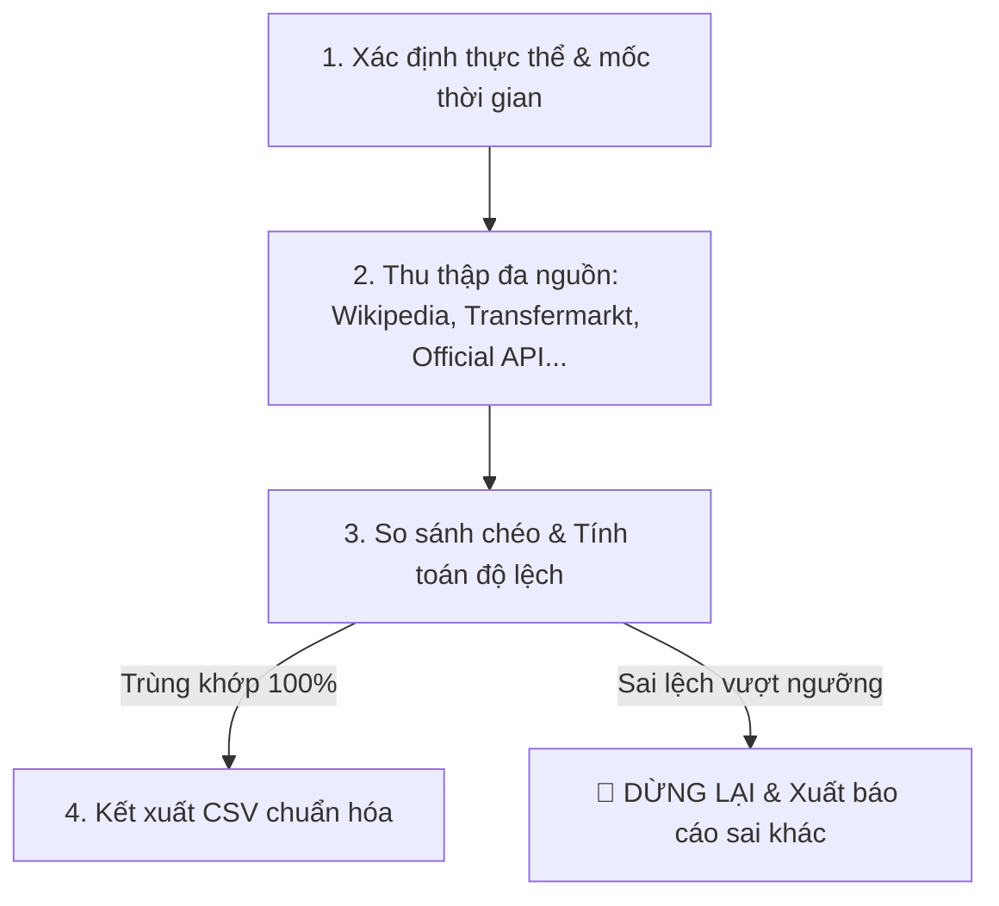

# Protocol chuẩn hóa dữ liệu & So sánh đa nguồn cho AI Agents (Data Preparation Protocol)

> [!IMPORTANT]
> Tài liệu này đóng vai trò là **"Hợp đồng hành vi" (Behavioral Contract) bắt buộc** cho bất kỳ AI Agent nào tham gia vào dự án RaceVideo Studio. Agent phải tuân thủ nghiêm ngặt quy trình thu thập, so sánh chéo, phát hiện mâu thuẫn và chuẩn hóa dữ liệu CSV/JSON để phục vụ dựng video animated ranking. **TUYỆT ĐỐI KHÔNG ĐƯỢC BỊA ĐẶT DỮ LIỆU (ZERO HALLUCINATION).**

---

## 🎯 1. Nguyên Tắc Cốt Lõi (Core Commandments)
1. **Chính Xác Lịch Sử**: Dữ liệu ranking/metric phải phản ánh 100% kết quả thực tế lịch sử.
2. **Không Bịa Đặt (Zero Hallucination)**: Tuyệt đối không tự suy diễn hoặc tự sinh số liệu giả lập khi không tìm thấy nguồn chính thức. Nếu thiếu dữ liệu, phải báo cáo và dừng lại.
3. **So Sánh Đa Nguồn (Multi-Source Cross-Verification)**: Mỗi chỉ số (points, population, cap,...) phải được đối chiếu chéo từ **tối thiểu 2 đến 3 nguồn độc lập**.
4. **Ngừng Hoạt Động Khi Mâu Thuẫn (Stop-on-Conflict)**: Nếu độ lệch dữ liệu giữa các nguồn vượt ngưỡng cho phép, Agent bắt buộc phải dừng lại, xuất báo cáo sai khác và yêu cầu con người (User) can thiệp.

---

## 🛠️ 2. Quy Trình 4 Bước Thu Thập & Xác Minh (Data Verification Pipeline)



### Bước 1: Định hình cấu trúc thời gian và thực thể
* Xác định cột đầu tiên làm Trục thời gian (Ví dụ: `Round` cho vòng đấu bóng đá, `Year` cho dân số/GDP, `Date` cho tiền điện tử).
* Xác định danh sách đầy đủ các thực thể tham gia (Ví dụ: đầy đủ 20 đội bóng Premier League, không được thiếu bất kỳ thực thể nào).

### Bước 2: Thu thập từ 2 - 3 nguồn độc lập
* **Nguồn A (Primary - Wikipedia/Official)**: Nguồn tham chiếu cấu trúc nền tảng.
* **Nguồn B (Secondary - Chuyên ngành)**: Transfermarkt/Fbref (đối với bóng đá), World Bank/IMF (kinh tế), Yahoo Finance/CoinGecko (tài chính).
* **Nguồn C (Tertiary - Báo chí/Lịch sử)**: Sky Sports, BBC, hoặc các kho lưu trữ uy tín.

### Bước 3: So sánh chéo (Cross-Verification Matrix)
Agent phải xây dựng ma trận đối chiếu điểm số hoặc chỉ số của từng thực thể tại từng mốc thời gian:
$$\Delta = |Value_{SourceA} - Value_{SourceB}|$$
* **Trường hợp trùng khớp ($\Delta = 0$)**: Chấp nhận dữ liệu.
* **Trường hợp lệch nhỏ (Ví dụ: Khác biệt do múi giờ cập nhật hoặc làm tròn số)**: Lấy giá trị từ Nguồn chính thống (Official) nhất và ghi chú lại.
* **Trường hợp lệch lớn hoặc mâu thuẫn dữ liệu ($\Delta > 0$ ở các chỉ số số nguyên như bàn thắng, điểm số)**: **DỪNG LẠI NGAY LẬP TỨC**.

### Bước 4: Xuất dữ liệu theo đúng Template CSV của RaceVideo Studio

---

## 📋 3. Định Dạng Template CSV Chuẩn (Strict CSV Specifications)

File đầu ra của Agent phải tuân thủ tuyệt đối các quy định kỹ thuật sau:
1. **Cột đầu tiên**: Tên cột là `Round`, `Year`, hoặc `Time`. Giá trị tăng dần đều (Ví dụ: từ 0, 1, 2, ... đến 38).
2. **Các cột tiếp theo**: Tên cột là tên của thực thể (Entity Name) viết chuẩn để Hệ thống tự động Enrich Logo (Ví dụ: `Manchester United`, `Arsenal` thay vì `Man Utd`, `ARS`).
3. **Giá trị dòng 0**: **Bắt buộc phải có dòng khởi đầu có giá trị 0** cho tất cả các thực thể (Ví dụ: `0,0,0,0...`) để biểu đồ lướt đi mượt mà từ điểm xuất phát.
4. **Không để trống**: Không có dòng trống, không có giá trị `NaN`, `Null`, hoặc ký tự lạ. Các ô trống phải tự động điền `0`.

#### Ví dụ File CSV chuẩn:
```csv
Round,Arsenal,Man City,Man United,Chelsea
0,0,0,0,0
1,3,1,1,0
2,6,4,4,1
3,9,7,5,4
```

---

## 🛑 4. Giao Thức Khi Có Lỗi (Error Handling Protocol)

Nếu phát hiện bất kỳ sự cố nào dưới đây, AI Agent **không được phép tiếp tục ghi đè file**:
* **Lỗi thiếu thực thể (Missing Entity)**: Ví dụ giải đấu có 20 đội nhưng dữ liệu chỉ thu thập được 19 đội.
* **Lỗi lệch mốc (Time-step Mismatch)**: Số vòng đấu không đủ 38 vòng hoặc mốc năm bị nhảy cóc không lý do.
* **Lỗi lệch số liệu (Data Discrepancy)**: Ví dụ Nguồn A ghi Arsenal 85 điểm, Nguồn B ghi 83 điểm.

**Hành động bắt buộc của Agent**:
1. Ngắt ngay luồng xử lý.
2. Tạo tệp `data_conflict_report.log` liệt kê chi tiết dòng dữ liệu bị lệch và nguồn tương ứng.
3. Thông báo hiển thị rõ ràng trên Console/UI để người dùng quyết định chọn nguồn nào.

---

> [!TIP]
> **Hướng dẫn cho các Agent tương lai**: Khi bạn đọc tệp này, hãy sử dụng công cụ `search_web` hoặc `read_url_content` để quét qua tối thiểu 3 trang web thể thao/dữ liệu trước khi tổng hợp tệp CSV. Hãy tôn trọng độ chính xác của lịch sử!
